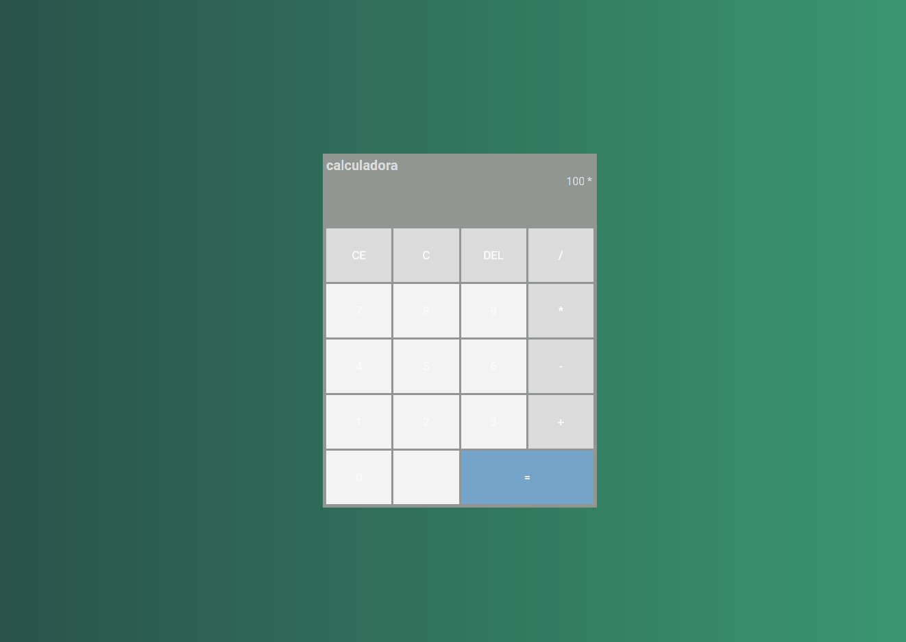

<h1 align="center">Calculadora 🖩</h1>

# Tecnologias usadas

Neste desafio desevolvi uma calculadora, para colocar o conhecimento de lógica de programação em pratica.

## Tecnologias usadas 🚀

- HTML
- CSS
- Javascript

## Imagens ✨

  

<a href="https://snazzy-tulumba-d7f27c.netlify.app/">
    link do projeto.
  </a>
